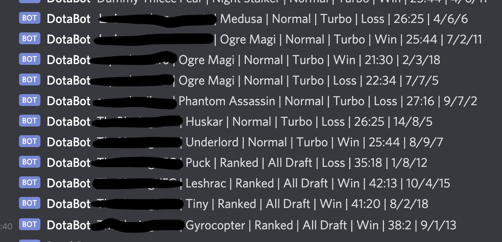

# Discord Dota Match Announcer



## Install

### Clone the repository

```shell
git clone https://github.com/Somefellow/DiscordDotaMatchAnnouncer.git
cd DiscordDotaMatchAnnouncer
```

### Check your Ruby version

```shell
ruby -v
```

Developed against `ruby 2.7.4`

If not, install the right ruby version using [rvm](https://github.com/rvm/rvm) (it could take a while):

```shell
rvm install 2.7.4
```

### Install dependencies

Using [Bundler](https://github.com/bundler/bundler):

```shell
bundle
```

### Initialise the configuration file

```shell
ruby generate_data_file.rb
```

Then open `data.json` and fill in the `config` section.

### Add players to be tracked

Go to the user's profile on OpenDota, then grab the player ID from the URL: `https://www.opendota.com/players/<player_id>`

```shell
ruby track_players.rb <player_id_1> <player_id_2> <player_id_3>...
```

### Announce matches

```shell
ruby main.rb
```

### Install to cron

Configure rvm in cron

```shell
rvm cron setup
```

Edit cron

```shell
crontab -e
```

Add the following line:

```shell
*/15 * * * * cd <DIRECTORY_WHERE_APP_IS_INSTALLED> && ruby ./main.rb >>./cron.log 2>&1
```

The 15 minute interval above can be tweaked.

### Avoiding getting rate limited by OpenDota

Monitor the logs for the following:

```shell
x-rate-limit-remaining-month: 32963
```

### Localisation

TODO